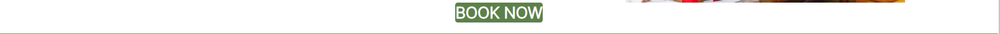

<h1 align="center">Canvas Carnival Website - Project Portfolio 1</h1>

---

# *Canvas Carnival*

Canvas Carnival website allows people to learn about the company "Canvas Carnival" and find information about current events. The visitors of the website could quickly navigate through scheduled events and book a selected day.

The site can be accessed by this [link](https://aleksandrasucho.github.io/painting_events/)

---

## User Stories

### First Time Visitor Goals:

* As a First Time Visitor, I want to easily understand the website's primary purpose, so I can learn more about the Event.
* As a First Time Visitor, I want the website to provide user-friendly navigation that allows me to easily explore and locate the desired content.
* As a First Time Visitor, I want to see the event schedule, this will help me plan my attendance and prioritize the events that interest me the most.
* As a First Time Visitor, I want to be able to book tickets for the event Returning Visitor Goals

### Returning VisitorGoals:

* As a Returning Visitor, I want to see information about new upcoming events.
* As a Returning Visitor, I want to find a way to get in contact with the event organization, so that I can ask additional questions.
* As a Returning Visitor, I want to have access to the Gallery which contains photos from past events. 

### Frequent Visitor Goals:
* As a Frequent User, I want to check for event updates. I want to stay up-to-date with any new information or changes regarding the event.
* As a Frequent User, I want the booking process to be as easy as possible.

+ ### Navbar

+ ##### Navigation
    - Positioned at the top of the page.
    - Contains logo of the company on the left side.
    - Contains navigation links on the right side:
        * HOME - leads to the home page where users can learn about the company Canvas Carnival.
        * EVENTS - leads to the events page where users can see information about current events. 
        * GALLERY - leads to the gallery page where users can see photos from past events.
        * BOOKINGS - leads to the booking form page where users can fill out the form in order to book a session and get in touch with the company.
    - The links have animated hover effect.
    - The navigation is clear and easy to understand for the user.
     
     - The navigation bar is responsive:
        * On tablets: 
        -   navigation bar is split into two lines: the first line filled with the logo and the second line filled with links. All elements are centered.
        

        * On mobile devices: 
            -  navigation bar is split into two lines: the first line filled with the logo and the second line filled with links. All elements are centered.     
            

    ---

+ ### Home Page

    - Represent: 

        * the main idea of the company.
        * Emphasize the strong points of the company.
        * Invites to fill out the bookings form.

    

---

+ #### Hero Section

    - Hero section have a fixed background image.

    - Hero section have a short quote in the center of the image.

    - Hero section have the block section below the image that consist:

        * Short description of the company's philosophy.

    
    

--- 

+ #### Information about the event Section

    - Information about the event Section has a small paragraph with a strong descriptive characteristics of the company.

    - Tells website visitors where the company is located.

    - Tells website visitors what the company provides for the events. 

    
    

    ---

+ #### Call to Action Section

    - Call to Action Section has a button that directs to the bookings page.
​
    

    ---
+ #### Footer

    - Footer contains social media links that open in a new tab.
​
    
​
---

+ ### Events Page

    - Events page has 4 cards with schedule for the upcoming week.

        - Each card contains a desciption of the painting for each day.

        - Each card has all the essential information like materials and time. 

    - It has a button right after the schedule that leads to the bookings form page.
    - It has a footer identical to the home page's footer.

    
---

+ ### Gallery Page

    - It has photos from the past events.

        - Each image has a hover effect.

    - It has a footer identical to the home page's footer.
    
​
    

---

---
+ ### Bookings page

    - Bookings page has a booking form:

        - All text input fields are customized.
        - All inputs are set to be required to fill out.
        - The submit button is animated on hover.

    - The page is responsive on all common screen sizes.

    - The submit button leads to the response page.
     - It has a footer identical to the home page's footer.
​
    

    ---
+ ### Response page

    - Response page appears after submitting the bookings form.
    - It contains the thank you message and the promise to get in touch with the applicant within 24 hours.
    - It will automatically direct the user to the main page in 10 seconds.
    - It has a footer identical to the home page's footer.

    

---
## Technologies Used

- [HTML](https://developer.mozilla.org/en-US/docs/Web/HTML) was used as the foundation of the site.
- [CSS](https://developer.mozilla.org/en-US/docs/Web/css) - was used to add the styles and layout of the site.
- [CSS Flexbox](https://developer.mozilla.org/en-US/docs/Learn/CSS/CSS_layout/Flexbox) - was used to arrange items simmetrically on the pages. 
- [Balsamiq](https://balsamiq.com/) was used to make wireframes for the website.
- [VSCode](https://code.visualstudio.com/) was used as the main tool to write and edit code.
- [Git](https://git-scm.com/) was used for the version control of the website.
- [GitHub](https://github.com/) was used to host the code of the website.
- [GIMP](https://www.gimp.org/) was used to make and resize images for the README file.

--- 

## Design

### Color Scheme

- Soft blue color was used as the main color of the website due to its phycological effect on people's minds. As this color is associated with trustworthiness and reliability, website visitors could build a firm believe in the organization "Animal Shelter".

- Light Blue Color was used as a background color since this color creates a sense of tranquility and makes a connection between animal's ownership and peacefulness.

- Purple color was used to make an emphasis on the logo and leave a memorable effect on the website visitors.